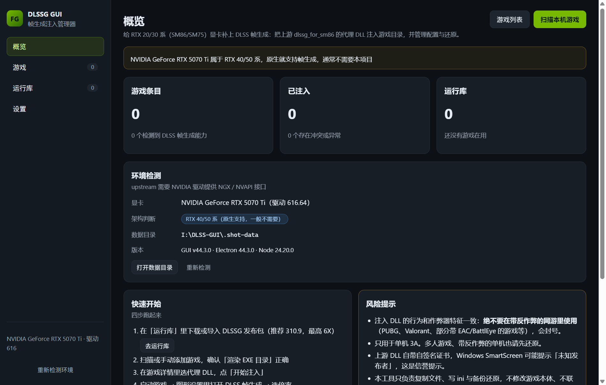

# DLSSG GUI — 帧生成注入管理器

给 **RTX 20/30 系（SM86 / SM75）** 显卡补上 NVIDIA DLSS 帧生成的图形化工具。

上游开源项目 [`sdli1995/dlssg_for_sm86`](https://github.com/sdli1995/dlssg_for_sm86) 用「代理 DLL + ini」的方式把 Ampere 优化的
DLSS-G 运行库塞进游戏进程，但它只有命令行/手工复制的用法。这个项目把它包装成一个 Windows 桌面软件：
**选游戏 → 选运行库与代理 → 一键注入 → 一键还原**，配置、备份、日志、扫描全在界面里。

> ⚠️ 注入 DLL 与作弊器行为特征一致。**绝不要在带反作弊的网游里使用**（PUBG、Valorant、带 EAC/BattlEye 的游戏等），会封号。
> 只用于单机 3A。



---

## 它到底做了什么

上游 0.3.0（代理模式）的部署动作只有两步：

1. 把一个代理 DLL（`version.dll`，或 `alternatives\` 里的 `winmm.dll` / `dbghelp.dll` / `dinput8.dll` / `dxgi.dll` / `d3d12.dll`）
   放进游戏的**渲染 EXE 目录**；
2. 同目录放一份 `dlssg_sm86.ini`。

代理 DLL 内嵌了未修改的原厂 DLSS-G 运行库与 SM86 后端，只拦截 `nvngx_dlssg.dll` 的加载，其余导出全部转发给
`C:\Windows\System32\` 里的同名真实 DLL。同一目录**只能启用一个代理**。

本软件把上面这套动作自动化，并且：

- 覆盖任何文件前**先备份**，并记录每个文件是「新建」还是「覆盖」；
- 记录注入文件的 SHA-256，改动过就能发现；
- 还原时按记录把文件删掉 / 还原成备份，可选清理日志目录；
- 注入前检查游戏是否在运行、目录里是否已有别的代理。

## 功能

| 模块 | 说明 |
| --- | --- |
| 游戏扫描 | 自动读 Steam（`libraryfolders.vdf` + `appmanifest_*.acf`）、Epic（`.item` 清单）、GOG（注册表），也支持手动选目录 |
| DLSS-G 探测 | 翻整棵目录树找 `nvngx_dlssg.dll` / `sl.dlss_g.dll`（UE 游戏把 DLSS 放在 `Plugins\NVIDIA\...\Binaries\ThirdParty\Win64`，**最深下探 9 层**），再按「旁边就是帧生成/超分 DLL、目录命名像渲染目录、EXE 最大」挑出真正的渲染 EXE 目录 |
| **上游跟踪** | 用 GitHub API 读仓库默认分支、最近提交、发行版与整棵树，**自动发现所有含 `version.dll` 的发布包目录**（新增版本会自动出现），并用 git blob 哈希比对本地已导入的版本，标出「有更新」 |
| 运行库管理 | 一键下载发现的发布包、导入 ZIP（GitHub 的 Download ZIP 里含多个版本会一起导入）、导入文件夹、直接指定单个 DLL |
| 每游戏配置 | 独立保存运行库、代理名、优化档位、倍率上限、渲染预设、日志等级、Runtime 键，以及「可选键目录」里的高级键与任意自定义键 |
| 防重复 | **一个游戏目录只有一条记录**：手动添加已在列表里的游戏会直接选中原来那条（不会再造一条带不同配置的重复项）；历史遗留的重复条目会在「游戏」页提示并可一键合并 —— 保留有注入记录的那条，历史、能力标记与注入记录（含备份目录）一并迁过去 |
| 一键注入 / 还原 | 预检查（阻塞项 / 提示）→ 写入 → 状态识别；还原支持「强制」与「保留日志」 |
| 文件与备份 | 每个游戏按时间分目录备份，可回滚；保留份数可配置 |
| 日志查看 | 直接读游戏目录 `dlssg_sm86\logs\*.jsonl`，汇总代理重定向 / 路由是否激活 / 错误行 |
| REFramework 助手 | 认得出卡普空 RE Engine 游戏（特征文件 `re_chunk_*.pak` / `re_dlc_*.pak`），详情页一键下载安装最新 [REFramework](https://github.com/praydog/REFramework-nightly) nightly，并记进还原清单（可一键卸载、被覆盖的 `dinput8.dll` 会还原） |
| 环境检测 | 读 `nvidia-smi` 拿显卡与驱动，判断 SM86 / SM75 / 40-50 系，给出驱动过旧的提醒 |

### 上游是怎么跟踪的

1. `GET /repos/sdli1995/dlssg_for_sm86` 拿默认分支，`/commits?per_page=1` 拿最新提交，`/releases` 拿项目版本（如 `0.3.4`），
   `/git/trees/<branch>?recursive=1` 拿整棵文件树；
2. 树里每个「直接含有 `version.dll`」（或 `alternatives\` 下代理）的目录就是一个发布包；`310.1` 这类目录没有自己的 ini 就回退到仓库根目录那份；
3. 下载时记录每个文件在仓库里的 **git blob sha**（本地用 `sha1("blob <len>\0" + 内容)` 算，和远端树里的 sha 可直接比），
   所以「有没有更新」不需要重新下载几百 MB，只比哈希；
4. 上游换了 DLL、加了新版本目录、发了新 tag，界面都会显示出来。

限制：GitHub API 未登录时每小时 60 次请求（一次检查约 4 次），结果缓存 5 分钟；触发限流时界面会提示，可以改用「导入 ZIP」。
下载优先走 `raw.githubusercontent.com`，失败自动换镜像，再失败走 GitHub API 的 `git/blobs` 接口（会顺带校验哈希）。


## 快速开始（开发）

```powershell
npm install          # 安装依赖（会下载 Electron 二进制）
npm run dev          # 开发模式启动，改代码热更新
npm run typecheck    # 类型检查
npm test             # 核心逻辑单元测试（ini、导入、注入、还原）
```

## 自检脚本

`tools/` 下有几个只读/可选的自检脚本，用来验证关键链路：

```powershell
# 真实环境跑一遍 Steam/Epic/GOG 扫描 + DLSS-G 能力探测（只读）
node --import ./test/loader.mjs tools/check-scan.mts

# 验证「上游发现 + 下载 + 哈希 + 更新比对」整条链路：会真的下载主分支发布包到数据目录后校验并清理
$env:DLSSG_GUI_DATA_DIR="$PWD\.check-download"; node --import ./test/loader.mjs tools/check-download.mts

# 看看上游仓库现在有什么（只读，走 GitHub API）
node tools/upstream-diff.mjs

# 检查 IPC 频道在 shared / preload / 主进程三处是否一致
node tools/check-ipc.mjs

# 重新生成图标
node tools/make-icon.mjs
```

### 推不上去的时候

`github.com:443` 在某些网络下会被重置/超时（`api.github.com`、`codeload.github.com` 却正常），这时 `git push` 用不了。
`tools/api-push.mjs` 用 Git 数据 API 走 `api.github.com` 把本地提交原样推上去：逐个上传 blob（内容取自本地对象库，
blob sha 一致）→ 用 `base_tree` 建树 → 建 commit → 移动分支引用；作者/提交时间/消息都对齐本地，
所以正常情况下生成的 commit sha 与本地完全相同，不会分叉。需要 `gh` 已登录。

```powershell
node tools/api-push.mjs            # 默认 origin/main
```


界面自检：设置 `DLSSG_GUI_SCREENSHOT=<png 路径>` 启动程序，加载完成 3 秒后会自动截图并退出，
用来确认打包产物能正常渲染。

## 打包成安装包 / 便携版

```powershell
npm run pack:win     # 先构建，再产出 NSIS 安装包 + 便携版到 release\
```

产物：

- `release\DLSSG-GUI-0.1.0-x64.exe` — 安装包（可选择安装目录，开始菜单/桌面快捷方式）
- `release\DLSSG-GUI-0.1.0-portable.exe` — 便携版，双击即用

图标由 `node tools/make-icon.mjs` 生成（纯 Node 实现，无第三方依赖）。

> 国内网络提示：Electron 二进制与 `electron-builder` 的额外组件在 `github.com` / `objects.githubusercontent.com` 上，
> 慢的话在 `.npmrc` 里保留 `electron_mirror`、`electron_builder_binaries_mirror` 指向 npmmirror 镜像。
> 受限环境下（例如没有 `%LOCALAPPDATA%` 写权限）可设 `electron_config_cache` 指向可写目录。

## 数据目录

默认 `%APPDATA%\dlssg-gui`（Electron userData），里面有：

```
packages\   导入/下载的运行库包（每个包一个目录，含 dlssg-gui-package.json）
backups\    <游戏 id>\<时间戳>\ 注入前的原始文件
logs\       本软件自己的日志
games.json  游戏条目与注入记录
packages.json
settings.json
```

- 便携模式：在 exe 旁放一个 `portable.txt`，数据改放 `exe 同级的 data\`。
- 也可以用环境变量 `DLSSG_GUI_DATA_DIR` 指定。

## 验证情况（本机实测）

- `npm run typecheck` 通过；`npm test` **27 项全通过**（ini 往返与档位/默认值、三态键、文件夹与 ZIP 导入、
  注入→状态→改配置→拒绝还原→强制还原全流程、多代理不再阻塞、重复条目判定与合并（含备份迁移后仍能还原）、
  UE/Unity 两种游戏目录布局的探测、REFramework 识别与安装/卸载（含 `dinput8.dll` 备份还原）、
  git blob 哈希、上游树解析）。
- REFramework 链路实测（2026-09-19）：识别出 nightly `01424`，经镜像下载 12.7MB 的 `REFramework.zip` → 解压 →
  装进假游戏目录（`dinput8.dll` + `reframework_revision.txt`）→ 卸载后完全还原。
- 真实环境扫描：读到 5 个 Steam 库、24 个游戏，0.3s 完成，**7 个**检测到 DLSS 帧生成能力
  （黑神话悟空 / COD HQ / **光与影：33 号远征队** / 死亡搁浅 2 / 无人深空 / PRAGMATA / 巫师 3 DX12），
  渲染目录全部选中正确（例如远征队 → `Sandfall\Binaries\Win64`，悟空 → `b1\Binaries\Win64`），
  另外认出 3 个只有 DLSS 超分的游戏。
- 上游跟踪实测（2026-09-18，上游 0.3.4）：自动发现 4 个发布包 —— 根目录（310.9，6X，主 DLL 30,011,168 字节）、
  `310.1`（4X，27,986,208 字节）、`archive/0.1.0`、`archive/0.2.4`；`310.1` 目录没有自己的 ini，正确回退到仓库根目录那份。
- 「下载」实测：主分支发布包 6 个文件全部下载 → 导入 → SHA-256 校验通过 → 重新比对显示「已是最新」。
- 打包产物已在 `release\`；打包版与开发版都能正常启动并渲染界面（截图自检无控制台报错）。

> 注：本机显卡是 RTX 5070 Ti，界面会提示「40/50 系原生支持、通常不需要本项目」。
> **没有**在真实的 RTX 20/30 系显卡上跑过实际游戏的帧生成效果，那一环需要实机验证。

## 目录结构

```
src/
  main/            主进程：文件操作、扫描、注入、日志、IPC
    inject.ts      注入/还原引擎（备份清单、哈希校验、进程检查）
    library.ts     运行库导入（文件夹 / ZIP / GitHub 下载 / 单个 DLL）
    scan.ts        Steam / Epic / GOG 扫描与 DLSS-G 探测
    logs.ts        游戏侧 jsonl 日志读取与汇总
    ipc.ts         IPC 注册
  preload/         contextBridge 暴露 window.api
  renderer/        React 界面（概览 / 游戏 / 详情 / 运行库 / 设置）
  shared/          主进程与界面共用的类型、ini schema、IPC 契约
test/              核心逻辑测试（原生 TS 运行，不经过打包器）
tools/             图标生成、扫描自检、下载自检、IPC 一致性检查
docs/              截图与给测试机的使用说明
```

## dlssg_sm86.ini 配置项

跟随上游 **0.3.4**（键与语义见其 `docs/INSTALL.md`）。界面里核心键是表单，其余高级/诊断键放在「可选键目录」里按需添加；
目录里没有的键可以用「自定义键」原样透传。

### 核心键（一定会写进生成的 ini）

| 段 | 键 | 取值 | 说明 |
| --- | --- | --- | --- |
| `[General]` | `Enabled` | 0/1 | 1 启用帧生成（用内嵌运行库）；0 关掉，游戏自带 DLSS-G 原样加载 |
| `[FrameGeneration]` | `Optimized` | **0–3** | 一致性档位。0 原厂内核不加速；**1 全部加速、与官方输出逐位一致（出厂默认）**；2 再加有损图像内核（PSNR ≳50 dB，仅 310.9）；3 全部有损最快（仅 310.9）。0.3.2 之前这项是 0/1 开关，本工具读老配置时会自动转换 |
| `[FrameGeneration]` | `MaxGeneratedFrames` | 1–5 | **出厂默认 3（=4X）**，上游 0.3.1 起从 5 改成 3（用户反馈 6X 默认太高）；5 = 最高 6X，仅 310.9 构建 |
| `[Compatibility]` | `Preset` | Auto/A/B | 仅 310.9 构建有效；UI 重组，多数游戏下 B 等于没开 |
| `[Logging]` | `Level` | 0–3 | 0 关闭，1 仅错误，2 配置与能力，3 内核与求值轨迹 |
| `[Logging]` | `Directory` | 路径 | 默认 `dlssg_sm86\logs`，相对 ini 所在目录 |
| `[Runtime]` | `Mode` | Bundled | 常规用法保持 Bundled |
| `[Runtime]` | `CacheDirectory` | 路径 | 留空 = `%LOCALAPPDATA%\DlssgSm86\bundles` |

### 可选键目录（默认不写，缺失时上游取安全默认值）

`Router`（Auto/SM86/SM75）、`SM75Family`（Repaired/Original）、`KernelImage`（Auto/PTX/Cubin/Original）、
`SpoofArchToGame`（三态：不写=自动 / 1 / 0）、`SpoofArchValue`（Auto/Ada/Blackwell）、
`SkipRepeatedRealCopy`、`HardwareBilinear`、`ForceGeneratedFrames`、`ForcePluginFrames`、
`[Logging] File / DebugOutput / EvaluateEvery`、`[Debug] MarkGeneratedFrames / MarkerX / MarkerY / MarkerScale / Capture / CaptureDirectory / MfgProbe`。

`Router=SM75`、`ForcePluginFrames`、`SkipRepeatedRealCopy` 等在界面上会标「实验性」；打开 `HardwareBilinear`、`Capture`、
`MarkGeneratedFrames` 这类会降性能，界面标「可能降性能」。

帧生成没生效时的排查顺序：`dlssg_sm86\logs\loader_*.jsonl` 里应有 `runtime_redirect`（代理已生效）→
`backend_*.jsonl` 里应有 `install` 且 `route active=true`（路由已激活）。缺失通常是驱动/运行库不匹配，会回退原厂路径。
把 `Level` 调到 2 或 3 再跑一次游戏；上游 0.3.x 还有始终开启的 `fg_gate_*` 记录，能看出是哪道闸门拦住了。

## 游戏里为什么看不到帧生成选项

三件事是分开的，别混在一起：

1. **游戏带不带 DLSS-G 运行库** —— 这是本工具扫描出来的「支持帧生成」，只看文件，跟显卡无关。
   注意 UE 游戏的 DLSS 埋在 `Plugins\NVIDIA\StreamlineCore\Binaries\ThirdParty\Win64`（约 8 层深），
   例如《光与影：33 号远征队》就在这一层带 `nvngx_dlssg.dll`（310.2.1）与 `sl.dlss_g.dll`（2.7.30）。
2. **显卡和游戏那道闸门** —— Streamline 的 `sl.dlss_g` 插件默认要求 AD100（Ada/40 系）以上，
   在 20/30 系上游戏会判定「本硬件不支持」并把帧生成选项藏起来。上游正是改写架构上报
   （`[Compatibility] SpoofArchToGame`，不写 = 自动、对 Turing 与 Ampere 都报 Blackwell）来放行这道闸门，
   所以**注入是必须的**，光有 DLL 不够。
3. **能不能到 6X** —— 取决于游戏自带 `sl.dlss_g.dll` 的版本：≥2.11.1 才支持 6X；
   33 号远征队带的是 2.7.30（4X 档），上游实测对这类游戏强推 6X（`ForcePluginFrames`）会让整个帧生成硬失败，别开。

另外要区分 **AMD FSR3 帧生成**：不少游戏（33 号远征队、死亡搁浅 2 等）在渲染 EXE 旁边放了
`amd_fidelityfx_framegeneration_dx12.dll`，这是 AMD 的帧生成，任何卡都能开，
所以「游戏里有帧生成选项」不等于「DLSS 帧生成可用」。本工具在候选目录后面会标出「含 FSR 帧生成」。

## 卡普空（RE Engine）游戏必须先装 REFramework

新一代卡普空游戏（Pragmata、生化危机安魂曲、龙之信条 2、怪物猎人荒野…）会拒绝加载游戏目录里它不认识的 DLL：
只放 `version.dll` 会**直接崩在启动**，换成 `dxgi.dll` / `winmm.dll` 也一样。
社区确认的做法是先装 [REFramework](https://github.com/praydog/REFramework-nightly)（游戏放行的加载入口），
上游 issue [#77](https://github.com/sdli1995/dlssg_for_sm86/issues/77) / [#40](https://github.com/sdli1995/dlssg_for_sm86/issues/40) /
[#560](https://github.com/sdli1995/dlssg_for_sm86/issues/560) 都是这件事。上游 0.3.3 期间还额外有一个架构改写误伤导致的崩溃，0.3.4 已修。

工具里的流程（认定 RE Engine 的依据是游戏目录里的 `re_chunk_*.pak` / `re_dlc_*.pak`）：

1. 详情页点「下载并安装 REFramework」→ 装到游戏根目录（`dinput8.dll` + 一个版本说明文件）；
   官方通道（`github.com` / `release-assets.githubusercontent.com`）在部分网络下连不上，会自动换镜像重试，
   都不行就用「用本地 ZIP 安装」装手动下载的 `REFramework.zip`。
2. 启动一次游戏让它加载框架（这时会生成 `reframework\` 文件夹），然后完全退出。
3. 回来重新注入代理 DLL，游戏里就能开 DLSS 帧生成。

装进去的文件都记在游戏条目里，点「卸载 REFramework」会删掉新建的文件、并把被覆盖的 `dinput8.dll` 还原。

## 已知限制

- **只支持 Windows x64 + D3D12**，游戏必须原生支持 DLSS 帧生成。
- **RTX 20 系（Turing / SM75）**：上游 0.3.1 修好了 20 系开不了帧生成的问题，0.3.2 实测 2080 Ti 输出与 3080 Ti 逐位一致，
  0.3.3 起会在游戏启动前改写架构闸门让游戏放出 3X/4X/6X 选项，0.3.4 修掉了该改写误伤 DLSS 超分模型导致的 30 系驱动重置。
  出厂 ini 直接用即可（内核族按物理显卡自动选 SM75）。Turing 上的性能上游尚未测量。
- 6X（Dynamic MFG）能否用取决于游戏自带插件的版本：自带 4X 插件的游戏无法被抬到 6X（上游试过内存补丁，跑几帧后整个帧生成会硬失败，已结论为不可用）。
- 同一目录里放多个代理不再会互相破坏（游戏先加载的那个生效，其余只转发），但本工具只推荐留一个。
- 装在 `Program Files` 下的游戏写入可能需要管理员权限；本软件会给出写入失败的提示，可以右键「以管理员身份运行」。
- 本软件不修改游戏本体、不联网上传任何数据；网络请求只有三个去处：GitHub API（查上游树）、
  `raw.githubusercontent.com` / 镜像（下 DLL）、`nvidia-smi`（本地读显卡）。

## 许可与致谢

- 本软件源码：**GPL-3.0-only**，见 [`LICENSE`](LICENSE)。
- 本仓库**不含**任何 NVIDIA 运行库文件；第三方材料归属见 [`THIRD_PARTY_NOTICES.txt`](THIRD_PARTY_NOTICES.txt)。
- 运行库来自 [`sdli1995/dlssg_for_sm86`](https://github.com/sdli1995/dlssg_for_sm86)（GPLv3）；其内嵌的 `nvngx_dlssg.dll`、
  模型与内核资源版权归 NVIDIA 及上游第三方，**不随本仓库分发**，需要用户自行下载或导入。
- RTX 20 系（SM75）内核族来源：Coldwood1026 的适配工作（见上游 `THIRD_PARTY_NOTICES.txt`）。

